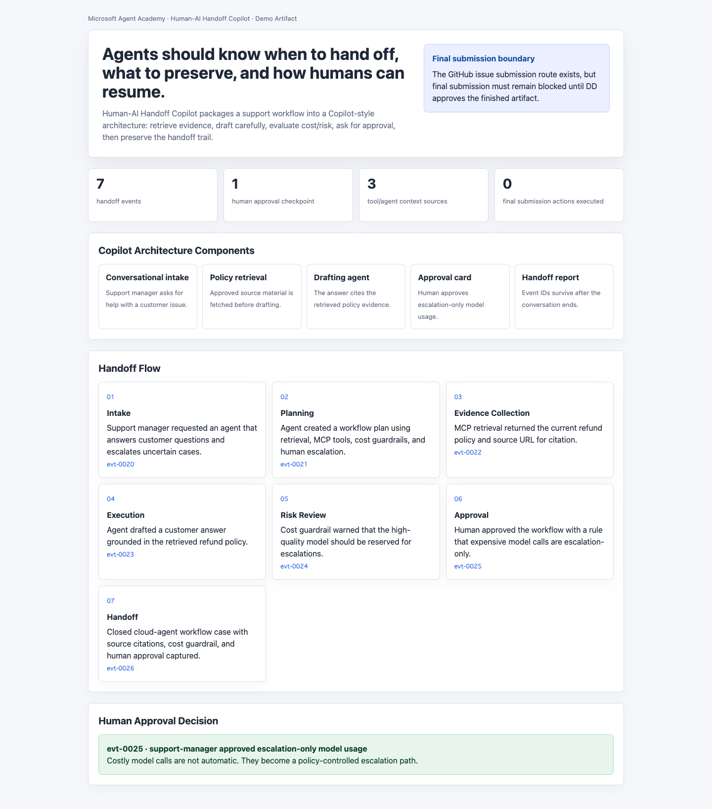

# Human-AI Handoff Copilot

Human-AI Handoff Copilot is a Microsoft Agent Academy prototype for moving work between humans and AI agents without losing context, approvals, or evidence.

The strongest agents are not the ones that pretend to finish everything alone. They are the ones that know when to hand off, what to preserve, and how a human can safely resume.

Submission package: [SUBMISSION_PACKAGE.md](SUBMISSION_PACKAGE.md)

## Demo



Draft demo video:

```text
microsoft-agent-academy/media/human-ai-handoff-copilot-demo-draft.mp4
```

Open locally:

- `microsoft-agent-academy/prototype/handoff-copilot-architecture.html`
- `shared-agentops-engine/web/index.html`

## What It Shows

- Handoff-first workflow architecture
- Evidence and context preserved across the handoff
- Approval points before risky action
- GitHub issue submission draft
- Shared AgentOps event trail

## Run Locally

```bash
cd shared-agentops-engine
python3 scripts/generate_portfolio_artifacts.py
python3 scripts/verify_artifacts.py
```

```bash
cd ../microsoft-agent-academy
python3 scripts/build_handoff_copilot_architecture.py
bash scripts/build_demo_video.sh
```

Expected proof:

```text
verify_ok
status: ok
```

## Hackathon Boundary

Safe claim:

- A local Copilot-style handoff architecture, screenshot, and GitHub issue draft are generated.

Not claimed yet:

- Live Copilot Studio implementation.
- Final GitHub issue submission.
- Acceptance of any platform terms on behalf of the user.

## Project Layout

- `microsoft-agent-academy/` - Microsoft-focused prototype, screenshot, and issue draft
- `shared-agentops-engine/` - shared event stream, adapters, dashboard, and verifier
